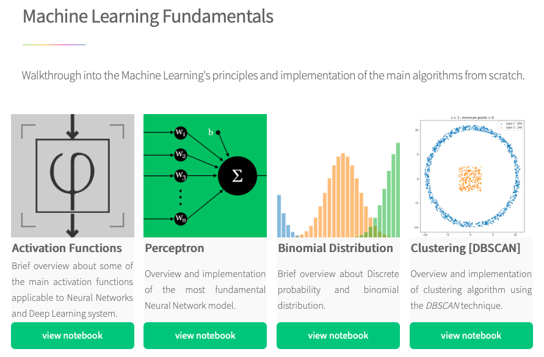

# Python for economists

## Why should economists learn how to code python? 

The digital age and data revolution have broadened the appeal of data science methods in both the private sector and academic research. Our modern economy becomes increasingly digitised, while larger computing power and novel data sources provide new opportunities to investigate economic relationships. 

As a starting point, python programming is particularly apt for research topics surrounding financial and social networks, as well as heterogeneous agent modelling. In addition, it provides powerful data management, visualisation, econometrics, automation tools and serves as easy gateway to more general machine learning applications. Python loves BiG data! 

## What you can do

 

<!-- 

I am a success message

I am an error message

 -->

	

    <ul>
        <li> <b>Data management: </b> handling large data sets, cleaning and merging data, visualisation</li>
        <li><b>Data analysis: </b> forecasting, investment strategies, geo-mapping, numerical computation, statistical tests and machine learning </li>
        <li> <b>Automation & Productivity: </b> web-scraping, create LaTeX documents, automate tasks like opening 100 excel files and changing one row</li>
    </ul>

## Maschine learning [notebook collection](https://www.google.com/url?q=https%3A%2F%2Fdiegoinacio.github.io%2Fmachine-learning-notebooks%2F%3Ffbclid%3DIwAR0AwDmM7XbGVyaDqNcsIHhczC2tmlPRa5fXosZOl6BTM5co-DylLinYMCk&sa=D&sntz=1&usg=AFQjCNHBoJZY_UY1YwFqP8izhHJOkfCGrQ).

 
## Beginner python stuff 

[See here](/blog/2020/installpy/)

	
   
